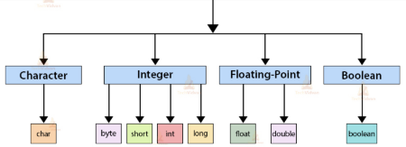
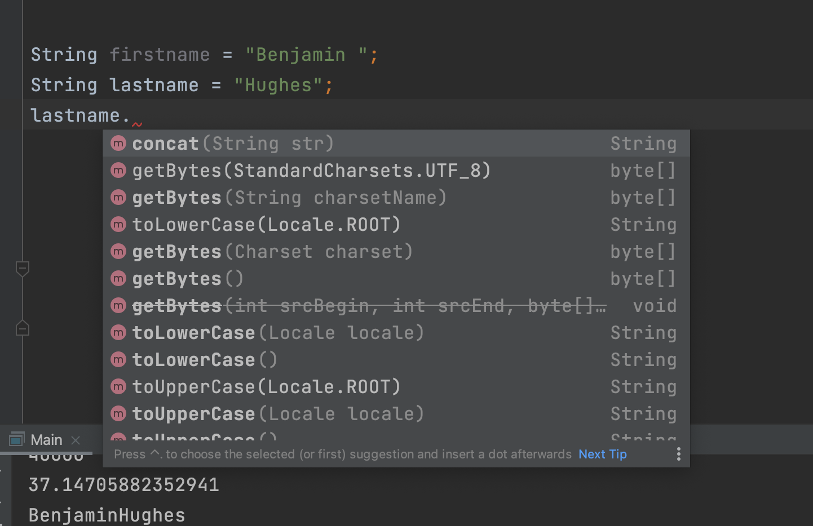

# Strings

Watch this video as support 👇

https://youtu.be/9R9nVa_MWPA


A string is a data type used for handling text. Strings are always sourrounded by double quotes. Here is an example:

```java
String fruit = "banana";
```


The way a string is built up is as a sequence of characters. So the first character in `fruit` is `b`, the second character is `a` and so on. *In programming languages the first element has index 0 (which is a bit weird in the beginning)*


That means that if we wanted the first character in a string we would get that at index 0!

```java
char firstCharacter = fruit.charAt(0);
System.out.println(firstCharacter); // prints b
```


String are different than the types we saw when working with `int`, `double` or `char`. `String` is called non primitive/complex data type. Lets get into the differences between primitive and non-primitive


## Primitive data types

There are 8 primitive data types in java as you can in the figure below. Primitive data types is predefined by its language and **holds the value of a variable directly in memory**! 





## Complex data types

This types has many names, it's also called reference types or complex types. Here the value of the some variable is not held in memory. **Instead a reference to the object is held in memory**!

There are some more differences that you will learn later. But one thing that is relevant now is that a `String` has methods that can be called on them. 

To call a method on a `String` write `.` and then the method you want to call. Here is an example

```java
String name = "Benjamin";
String upperCaseName = name.toUpperCase();
System.out.println(upperCaseName) // prints BENJAMIN
```


IntelliJ will autocomplete with methods when pressing `.` after a string variable as can be seen below



To find more methods see here: https://www.w3schools.com/java/java_ref_string.asp


Lets see some more examples

```java
String lastname = "Hughes";
lastname.toUpperCase(); // HUGHES
lastname.charAt(2); // g
lastname.length(); // 6

//We can even add strings together:
String firstname = "Benjamin ";
String lastname = "Hughes";
String fullname = firstname + lastname;
System.out.println(fullname); // Benjamin Hughes
```


## Exercises


### Exercise 1

In a group investigate two different string methods. 

You need to be able to explain what the method does but also how to use it in Java!

A couple of groups will be selected to show what they learned


### Execise 2

- Convert a string to uppercase
- Return the index of a character
- Concatenate two different string
- Check these strings are equal to each other. Uppercases should be ignored!
  - `hello`, `ollhe` should print `false`
  - `bike`, `banana` should print `false`
  - `name`, `NaMe` should print `true`
  - `yes`, `yes` should print `true`


### Exercise 3 

Løs de her opgaver: https://www.w3resource.com/java-exercises/string/index.php

1, 7, 8, 22


### Exercise 3.1

Create a java program that takes a string and a substring as input. The program should then check if the substring is part of the string 👇

```
Please input a string:
benjamin
Please input a substring to check:
jam
Is jam is part of Benjamin? true
```

```
Please input a string:
Camilla
Please input a substring to check:
was
Is was is part of Camilla? false
```

Alternatively you can write it like this (if you know if sentences):

```
Please input a string:
benjamin
Please input a substring to check:
jam
jam is part of Benjamin
```

```
Please input a string:
Camilla
Please input a substring to check:
put
put is not part of Camilla
```

*Ask your classmates about an if sentence!*


### Exercise 3.11

Write a program that takes a three character string as input and checks if the string is mirrored. The case should be ignored. fx `Lol` should return `true`

Here is an example

```
Please input a word:
lok
Can lok be mirrored: false
```

```
Please input a word:
lol
Can lol be mirrored: true
```

You can again write different messages if you know if sentences


### Exercise 3.21

Write a program that can check if a number is even. 

Now write a program that will check if a number is odd. 

*Hint: Read up on modulus!*


### Exercise 3.3

Write a program that takes two numbers. One that that decides the diviser and one that is the number that should be checked against the divider:

Example


```
Please put in the diviser:
5
Now please put in the number to check
35
Is 35 divisible with 5: true
```

```
Please put in the diviser:
6
Now please put in the number to check
13
Is 13 divisible with 6: false
```


### Exercise 🏎

Write a program that will check if the first character in a word comes later in the alphabeat than the last character in word

Example

```
Please write a word:
jungle
j comes after e in the alphabeat
```

```
Please write a word:
Bananas
B comes before s in the alphabeat
```


### Exercise 🍌

Write a Java program that accepts a 3 digit integer `n` and compute the sum of the digits of `n` 

Example:

```
Please input a number: 
334
The sum of 3 and 4 and 4 is 10
```


```
Please input a number: 
121
The sum of 1 and 2 and 1 is 4
```


### Exercise 🥁

Løs de her opgaver: https://www.w3resource.com/java-exercises/string/index.php

2, 3, 25